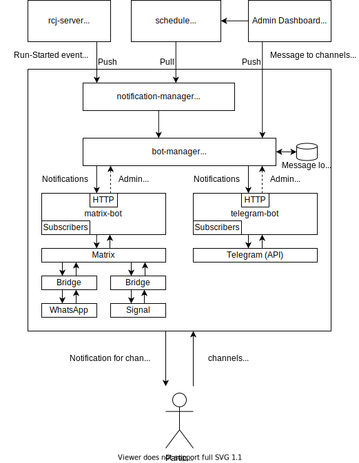

# rcj-notification-bot

## Purpose and goal

* send information to teams, coaches, visitors
* notify teams shortly before their run starts
* notify teams, coaches and visitors about delays
* show only relevant information of schedule
* easy and direct contact to teams to avoid questions and crowds around competition area / entry

## Application

* <s>Native App, Website, PWA</s>
* Messenger Bot
  * one bot for many messengers (WhatsApp, Signal, Telegram, ...) via Matrix
  * why?
    * requires no additional installation (in contrast to native app; assuming everyone uses some kind of messenger)
    * configure notifications easily (not necessary to allow certain permissions)
    * not much memory required, can also run easily in background (other apps might be killed to save power)
    * even if Telegram provides a good Bot API, most people use WhatsApp and they should not be forced to use a certain messenger (at least a few alternatives should be offered)
* users can subscribe to channels (e.g. `general`, `rescue line entry`, `team xyz`)
* team-level notifications when team before started

## Architecture

* Bot
  * general bot manager + messenger specific bots to handle direct user interaction
  * bot manager implements actual logic (sending messages to all users, ...) and gets information from other services (see below)
  * specific implementations, e.g. `TelegramBot` and `WhatsAppBot` which handle messenger specific stuff (sending the message, receiving a message, ...); either direct API (e.g. Telegram) or via Matrix Bridge
  * provide information how many users subscribed a channel (e.g. show overview on an admin dashboard)
* Notifications
  * based on `rcj-dss` and schedule &rarr; send message to team when previous team started
  * Web App or similar for admins to send messages to certain channels
* Schedule
  * provides information about schedule (which team, what time, which arena)

